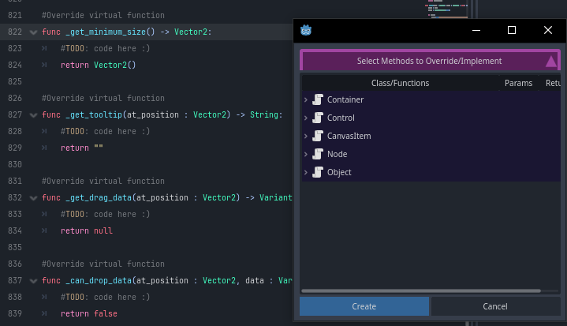
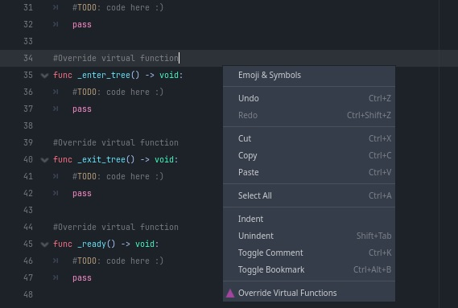
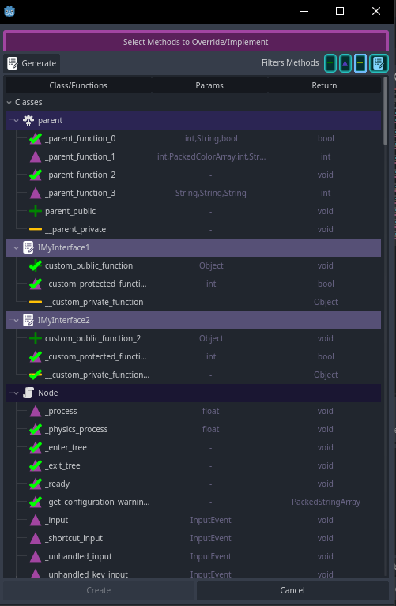
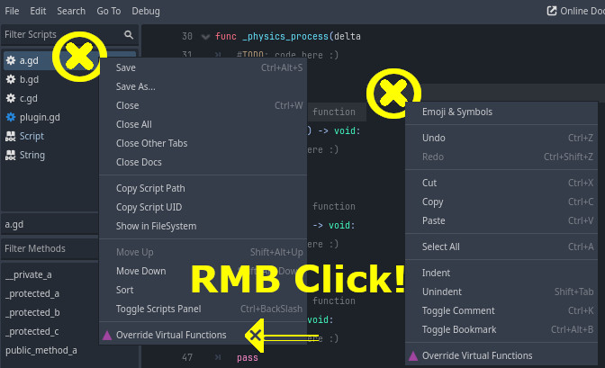

# GD-Override-Functions
Tool Addon for godot 4 for extend script editor feature.

[](https://godotengine.org/)  


This addon allow select **public / virtual / private** functions for be override/implement.

>[!NOTE]
>This plugin was initially created to be an complement to the [script-ide](https://godotengine.org/asset-library/asset/2206) plugin, this version is a **STANDALONE** version of the complement.

# Preview



### Filters (V0.2.0+)


# How Work
## Menu Override Function
Press RMB (Right Click Mouse Button) on the current editor script or in the script panel and select **Override Functions**.




# Syntax Work

Syntax of Virtual Function Example:
>[!TIP]
>As in other languages, **Virtual Functions** are those that name begin with "_" character **( not with "__" that is for private functions)**.

```python
# (OK) This is a virtual function.
func _virtual_function(foo : Variant) -> Void:
  pass

# (X) No Virtual Function.
func __private_function(foo : Variant) -> Void:
  pass

# (X) No Virtual Function.
func public_function(foo : Variant) -> Void:
  pass
```

Syntax of Interface Class Example:
>[!TIP]
>As in other languages, **Interface class** are those that class name begin with "I" (Upper case) character **( not with "i" )**.
```py
# (OK) This is a interface.
class_name IMyInterface extends Foo

# (OK) This is a interface.
Imy_file.gd # Yeah, files begin with "I" (upper case) too work! (class_name is not necessary if you don't want put in the script)

IAnotherFile.gd # Begin with "I", that is fine!

# (X) No custom interface class.
class_name my_normal_class extends foo

# (X) No custom interface class file script.
my_file.gd
```
>[!NOTE]
>Native classes were excluded because they could be confused with interfaces.

Copyrights (c) CodeNameTwister. See [LICENSE](LICENSE) for details.

[godot engine]: https://godotengine.org/
