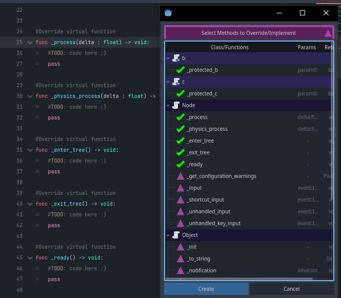

# GD-Override-Functions
Tool Addon for godot 4 for extend script editor feature.

  

This addon allow select virtual functions for be override/implement.

NOTE: This plugin was initially created to be an complement to the [script-ide](https://godotengine.org/asset-library/asset/2206) plugin, this version is a **STANDALONE** version of the complement.

# Preview

# How Work
Press RMB (Right Click Mouse Button) on the current editor script or in the script panel and select **Override Virtual Functions**.

### Example

Copyrights (c) CodeNameTwister. See [LICENSE](LICENSE) for details.

[godot engine]: https://godotengine.org/
